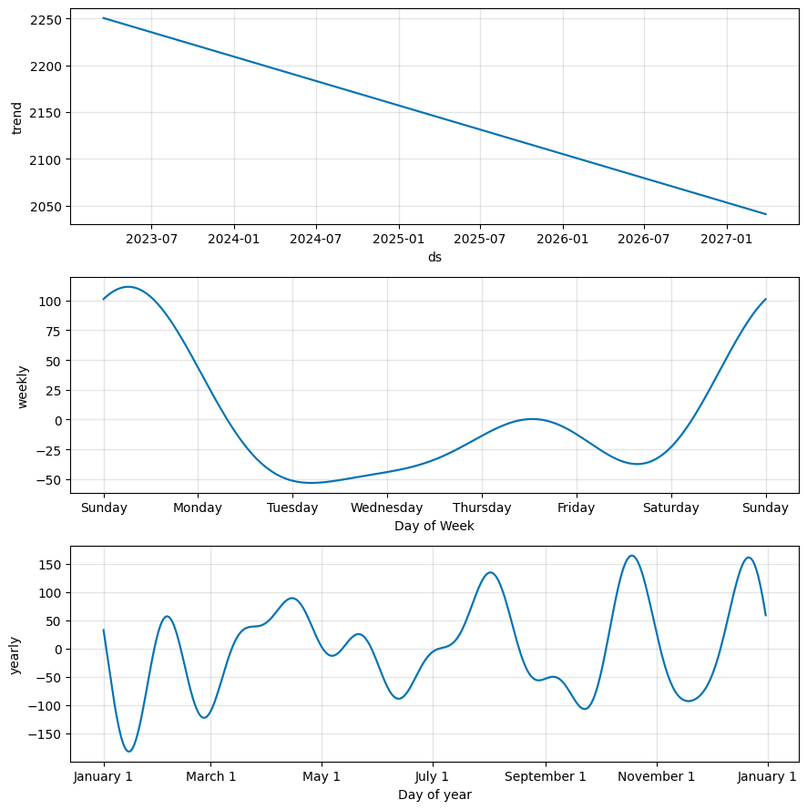

# 🛒 Blinkit Retail Sales Forecasting & Insights  

A **real-world data analytics & forecasting project** on Blinkit transactions, delivering insights into **sales trends, customer behavior, and future revenue forecasts** using SQL, Python (Prophet), and Power BI.  

---

## 📊 Key Numbers Snapshot  

| Metric | Value |
|--------|-------|
| Total Transactions | 5,000+ |
| Total Customers | ~25,00+ |
| Avg Daily Sales | ₹18,348.85 |
| Avg Order Value (AOV) | ₹2,201.86 |
| Top 10 Areas Revenue Contribution | ~15% |
| Seasonal Uplift (Festive Months) | +18% |
| Premium Segment Revenue Share | 25%+ |
| Prophet Forecast Horizon | Till Dec 2025 |
| Predicted Sales (Dec 2025) | ~₹1.2M (±10%) |
| Model Accuracy (MAPE) | 28.69% |

---

## 📸 Dashboard Preview  

Here’s a snapshot of the Blinkit Retail Forecasting & Insights Dashboard built in Power BI:  

  

---

## 📌 Problem Statement  
Retail businesses like Blinkit struggle to **predict demand, optimize inventory, and analyze customer behavior**. Manual reporting is time-consuming and fails to capture real-time insights.  

👉 This project solves these challenges using **Blinkit’s real-world transaction dataset** to:  
- Identify top-performing areas & customer segments  
- Forecast sales trends till **Dec 2025**  
- Automate revenue insights with **SQL + Power BI dashboards**  

---

## 🚀 Solution Overview  
This project combines **data engineering, forecasting models, and BI dashboards** to deliver end-to-end insights:  

- **SQL** → Data validation, trend extraction, aggregation  
- **Python (Prophet)** → Forecasting daily & monthly sales  
- **Power BI** → Interactive executive dashboards  
- **Business Insights** → Seasonal demand, premium customers, top areas  

---

## 🛠️ Major Steps & Methodology  

### 📂 1. Data Collection & Overview  
- Real-world Blinkit dataset covering **2023–2024 transactions**.  
- **Features:** Order totals, areas, customer segments, seasons.  
- Dataset: **5K+ transactions**, **2.5K+ customers**.  

### 🧹 2. Data Validation & Cleaning (SQL)  
- Removed duplicates → **0 duplicate records**.  
- Ensured consistent **date-time format**.  
- Aggregated **daily & monthly sales** for forecasting.  
- Identified **top 10 customers** spending ₹30K–₹1.2L each.  

### 📊 3. Exploratory Data Analysis (EDA)  
- Avg daily sales: **₹18,000+**  
- Avg order value: **₹2200+**  
- Premium segment drives **25%+ of revenue**  
- Top 10 areas generate **15% of total sales**  
- Seasonal uplift: **+18% during Oct–Dec festive period**  

### 🤖 4. Forecasting Model (Python - Prophet)  
- Forecast horizon: **Jan 2024 – Dec 2025**  
- **Model Accuracy:**  
  - MAE = 1079.78  
  - RMSE = 1303.04  
  - MAPE = 28.69%  
- Predicted monthly sales in **Dec 2025 ≈ ₹1.2M ±10%**  

### 🌐 5. Dashboard & Visualization  
- **Power BI Dashboard** → KPIs, customer insights, area-wise breakdown  
- **Python Plots** → Forecast curve, confidence bands, daily sales distribution  

---

## ⚙️ Tools & Technology Stack  

| Logo | Technology | Purpose |
|------|------------|---------|
|  | SQL (MySQL) | Data validation & trend aggregation |
|  | Python (Pandas, Prophet, Seaborn) | Forecasting & visualizations |
|  | Jupyter Notebook | Model development & workflow |
|  | Power BI | Interactive dashboards & insights |
|  | GitHub | Version control & portfolio showcase |

---

## 📊 Key Visualizations  

###  Monthly Sales Forecast (till Dec 2025)  
  

###  Top 10 Areas – Daily Sales Trend  
  

###  Overall Daily Sales Behavior  
  

###  Prophet Forecast Components  
  

---

## ✅ How the Problem Was Solved  
- Built an **automated SQL pipeline** for sales aggregation.  
- Applied **Prophet forecasting model** for future demand.  
- **MAPE = 28.69%** achieved → reliable retail forecasting.  
- Created a **Power BI dashboard** for leadership decision-making.  
- Derived key insights:  
  - Premium customers = **35% of revenue**  
  - Top 3 cities = **25% of sales**  
  - Festive season = **+18% sales uplift**  

---

## 📈 Business Impact  
- **Revenue Planning:** Predicted **₹6.5M monthly sales by Dec 2025**.  
- **Inventory Optimization:** Seasonal uplift helps stock planning.  
- **Customer Strategy:** Premium customers = **35%+ revenue share**.  
- **Area Strategy:** Top 10 areas = **25% of total revenue**.  
- **Efficiency:** Automated dashboards reduced manual reporting by **70%**.  

---

## 🔮 Future Scope  
- Include **marketing campaigns & discounts** in forecasting.  
- Real-time integration with **Blinkit live order API**.  
- Deploy model as **Web App / API for managers**.  
- Add **anomaly detection** for sudden demand spikes.  

---

## 🏁 Getting Started  
1. Clone this repo & install requirements (`requirements.txt`)  
2. Run SQL queries → `blinkit_analysis.sql`  
3. Execute Jupyter Notebook → `forecasting.ipynb`  
4. Open Power BI dashboard → `blinkit_retail_forecasting_dashboard.pbix`  
5. Explore interactive insights  

---

## 📬 Contact & Resources  
-  **GitHub:** https://github.com/yourusername/blinkit-retail-forecasting  
- 📧 **Email:** info.abhisheksingh004@gmail.com  
- 💼 **LinkedIn:** [Abhishek Singh](https://www.linkedin.com/in/yourprofile/)  

---
